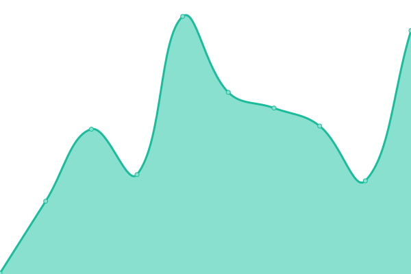
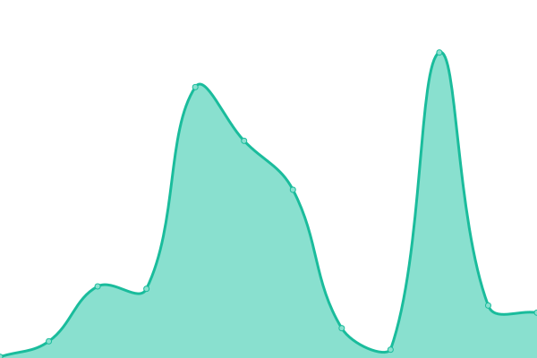

<!--start: status pages-->
<!-- This summary is generated by Upptime (https://github.com/upptime/upptime) -->
<!-- Do not edit this manually, your changes will be overwritten -->
<!-- prettier-ignore -->
| URL | Status | History | Response Time | Uptime |
| --- | ------ | ------- | ------------- | ------ |
|  [Portofolio](http://galacyber.is-a.dev) | 🟩 Up | [portofolio.yml](https://github.com/MGalaCyber/status/commits/HEAD/history/portofolio.yml) | 

 227ms
     
 | 

<a href="https://galacyber.is-a.dev/status/history/portofolio">100.00%</a>
    

|  [Universe API](https://api.universebot.space) | 🟩 Up | [universe-api.yml](https://github.com/MGalaCyber/status/commits/HEAD/history/universe-api.yml) | 

 187ms
     
 | 

<a href="https://galacyber.is-a.dev/status/history/universe-api">99.39%</a>
    

|  [CountDown NewYear](https://galacyber.is-a.dev/CountDown-NewYears) | 🟩 Up | [count-down-new-year.yml](https://github.com/MGalaCyber/status/commits/HEAD/history/count-down-new-year.yml) | 

 65ms
     
 | 

<a href="https://galacyber.is-a.dev/status/history/count-down-new-year">100.00%</a>
    

<!--end: status pages-->

## 📄 License

- Powered by: [Upptime](https://github.com/upptime/upptime)
- Code: [MIT](./LICENSE) © [MGalaCyber](http://galacyber.is-a.dev)
- Data in the `./history` directory: [Open Database License](https://opendatacommons.org/licenses/odbl/1-0/)
